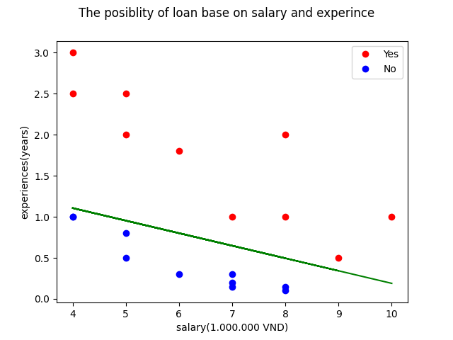
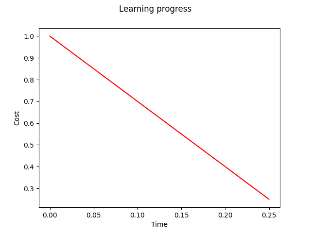

# Predict The Percentage Of Loan Possiblity Base On Salary And Experinces Of Customer
This repository is an example of using Logistic Regression in Machine Learning
## Code Requirements
This repository is in Python3. the other requirements are NumPy and Mathplotlib
## Description
The program using datasets from [dataset.csv](https://github.com/nttuan8/DL_Tutorial/blob/master/L2/dataset.csv) to train this. After training, computer computes theta vector to predict
## Execution
To run this example, run the `main.py` file using Python 3
```
python3 main.py
```
The output will look like this
```
LOADING DATA...COMPLETE
INITALISE MACHINECOMPLETE
LEARNING...COMPLETE
THETA = [[-134.92335074]
 [  12.00462837]
 [  78.50641455]]
COMPUTE COST = 0.00(ALPHA = 10.00, NUMBER OF ITERATOR = 500.00)
DISPLAY PLOT:
	FIGURE 1: DISPLAY RESULT
	FIGURE 2: LEARNING PROGRESS
```
Plots:



Prediction plot



Learning progress plot